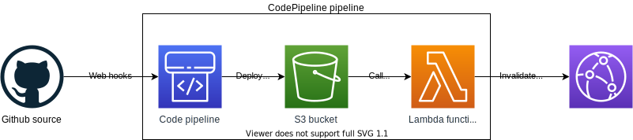

# Cloud Resume Challenge - CI/CD pipelines

This project is part of my attempt on [Cloud Resume Challenge](https://cloudresumechallenge.dev/)
- [Static web frontend](https://github.com/luzhkovvv/cloudresumesite)
- [Serverless backend](https://github.com/luzhkovvv/cloudresumecounter)
- CI/CD pipelines - this project

This project provides CI/CD pipelines for frontend and backend. Project is based on AWS services.

## Static web frontend pipeline

This pipeline uses following AWS services:
- CodePipeline - to coordinate pipeline execution steps
- Lambda - to perform custom actions

Logical diagram of solution:

### Source stage

- Github webhooks are used to initiate pipeline execution on code commits

### Deployment stage

- Builtin S3 Deploy action is used to extract and copy source files to S3 bucket
- Lambda function is used to create CloudFront cache invalidation to ensure up-to-date content is served to users.

## Serverless backend pipeline